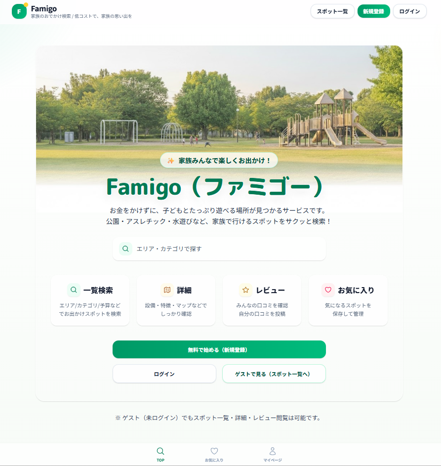
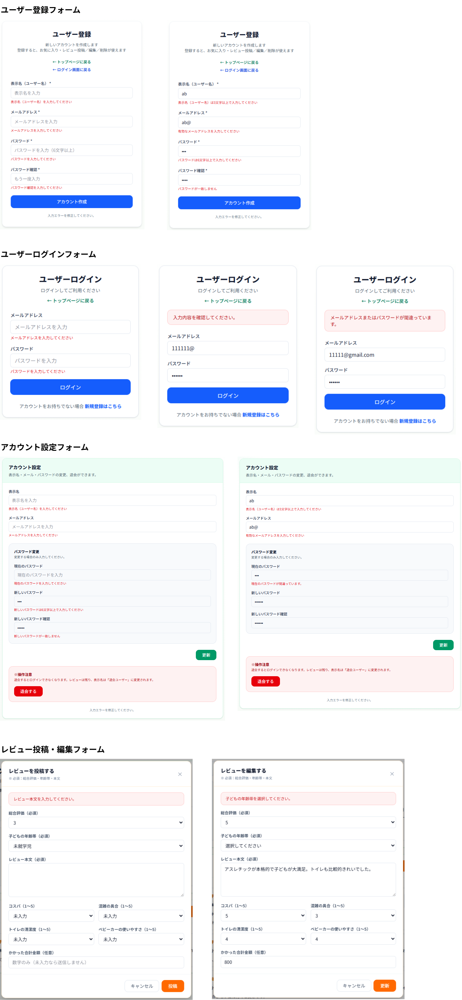
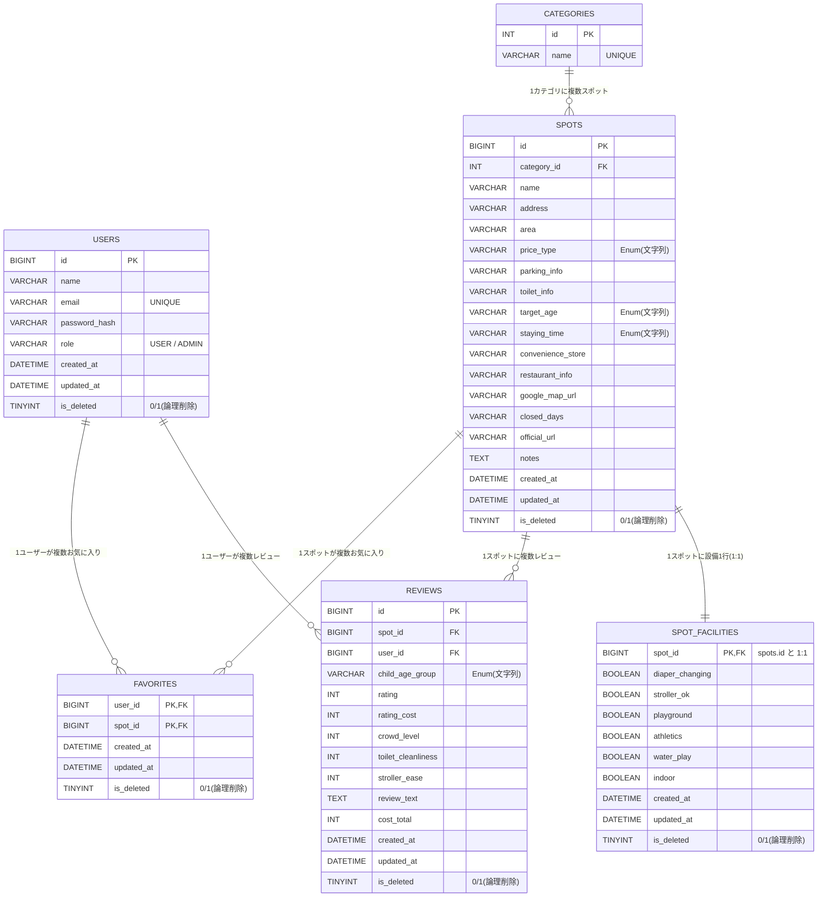

# Famigo（ファミゴー）

## サービス概要
Famigoは、「なるべくお金をかけずに、子どもとたっぷり遊べる場所」を探しやすくするためのサービスです。 
公園・アスレチック・水遊び場などのスポットを、**エリア / カテゴリ / 予算 / 対象年齢 / 設備（オムツ替え有無・ベビーカーOK等）**で絞り込み検索できます。

- 未ログインでも：スポット検索・詳細閲覧・レビュー閲覧OK
- ログインすると：お気に入り、レビュー投稿/編集/削除、アカウント設定が使えます

## 制作背景
私は２人の小学生の息子がおり、家族そろって楽しめる場所に出かけるのが大好きです。 
とは言ってもテーマパーク等のお金がかかる施設に頻繁に行けるわけでもなく、
安くて楽しい良い場所はないか、WEB情報をよく探していました。 
ただし、子どもと出かけるとなると、「楽しそう」だけではなかなか決められず **“条件”** が先に来ることが多いです。  
（オムツ替えはある？／ベビーカーいける？／トイレが気になる／水遊びできる？など） 
SNSや地図アプリ、個人ブログなどで家族向けのリアルな情報で見つけるのは簡単ですが、欲しい情報が揃うまでに時間がかかると感じていました。

そこで **「家族連れの気になるポイント」に寄せた検索と口コミ** をまとめて見られる場所が欲しくて作りました。

サービス名の「famigo（ファミゴー）」は、Family（家族）とGo（出かける）を組み合わせた造語です。 
語感を少しポップにし、家族向けらしい親しみやすさと「行ってみよう！」と前向きになれる雰囲気を意識しました。

## デプロイURL

https://famigo-odekake.com

### 【ゲストユーザーアカウント情報】 
　メールアドレス `demo_user@example.com`  
　パスワード  `demo1234`

## 主な使用技術

### バックエンド
- Java 21
- Spring Boot 3.5.7
- Spring Security（JWT）
- MyBatis
- Flyway（マイグレーション）

### フロントエンド
- React 19 / TypeScript
- Vite
- Tailwind CSS（v4）

### テスト
- JUnit 5

### インフラ・その他
- AWS（Route53 / CloudFront / S3 / VPC / ALB / EC2 / RDS / ACM）
- Docker（バックエンド）
- MySQL
- Git・GitHub

## 機能一覧

### 認証・ユーザー
- ユーザー登録（登録後、自動ログイン）
- ユーザー情報編集（表示名、メールアドレス、パスワードの変更）
- ユーザー削除
- ログイン
- ログアウト

### お出かけスポット
- スポットの一覧表示
- スポットの詳細表示
- スポットの条件検索

### レビュー（ログイン必須）
- レビューの一覧表示（未ログインでも閲覧可）
- レビューの投稿
- 自分のレビュー編集／削除

### お気に入り（ログイン必須）
- お気に入りの登録／解除
- お気に入りの一覧表示

## 操作画面

### トップページ

### ユーザー登録
<video src="images/ユーザー登録.mp4" controls width="600"></video>

### ユーザーログイン → ログアウト
<video src="images/ユーザーログイン・ログアウト.mp4" controls width="600"></video>

### アカウント設定（プロフィール更新・パスワード変更）
<video src="images/アカウント設定.mp4" controls width="600"></video>

### スポット一覧表示 → 条件検索 → 条件該当のスポット一覧表示 → スポット詳細表示
<video src="images/スポット検索.mp4" controls width="600"></video>

### レビュー閲覧 → レビュー投稿
<video src="images/レビュー閲覧・投稿.mp4" controls width="600"></video>

### 自分のレビュー編集 → 自分のレビュー削除
<video src="images/レビュー編集・削除.mp4" controls width="600"></video>

### お気に入りの登録／解除 → お気に入り一覧表示
<video src="images/お気に入り登録・解除・一覧.mp4" controls width="600"></video>

### フォームバリデーション

## API仕様書
[SwaggerによるAPI仕様書](https://tomo-taka108.github.io/famigo-backend/)

## APIのURL設計

### 外部認証
| メソッド | エンドポイント           | 説明                      | 認可 |
|------|-------------------|-------------------------|---|
| POST | `/api/users`      | ユーザー情報を新規登録する（登録後にJWT発行） | GUEST |
| POST | `/api/auth/token` | ログインする（JWT発行）           | GUEST |

### ユーザー情報管理
| メソッド | エンドポイント          | 説明                          | 認可 |
|---|------------------|-----------------------------|---|
| GET  | `/api/users/me`  | 自分のユーザー情報を取得する              | USER/ADMIN |
| PUT | `/api/users/me`  | 自分のプロフィール（表示名＋メールアドレス）を変更する | USER/ADMIN |
| PUT | `/api/users/me/password` | 自分のパスワードを変更する               | USER/ADMIN |
| DELETE | `/api/users/me`  | 退会する（ユーザー情報の論理削除）           | USER/ADMIN |

### スポット
| メソッド | エンドポイント | 説明                         | 認可 |
|---|---|----------------------------|---|
| GET | `/api/spots` | 検索条件（※）を任意に指定してスポット一覧を取得する | GUEST |
| GET | `/api/spots/{id}` | 指定したスポットの詳細情報を取得する         | GUEST |

**（※）検索条件** 
　キーワード、カテゴリ、予算、対象年齢、設備情報 

　【検索クエリ例（フロントから利用）】 
　`/spots?keyword=公園&categoryIds=1&price=FREE&age=PRESCHOOL&facilities=diaper&facilities=water`

### カテゴリ
| メソッド | エンドポイント | 説明          | 認可 |
|---|---|-------------|---|
| GET | `/api/categories` | カテゴリ一覧を取得する | GUEST |

### レビュー
| メソッド | エンドポイント | 説明                    | 認可 |
|---|---|-----------------------|---|
| GET | `/api/spots/{spotId}/reviews` | 指定したスポットのレビュー一覧を取得する  | GUEST |
| POST | `/api/spots/{spotId}/reviews` | 指定したスポットのレビューを投稿する    | USER/ADMIN |
| PUT | `/api/spots/{spotId}/reviews/{reviewId}` | 指定したスポットの自分のレビューを編集する | USER/ADMIN |
| DELETE | `/api/spots/{spotId}/reviews/{reviewId}` | 指定したスポットの自分のレビューを削除する | USER/ADMIN |

### お気に入り
| メソッド | エンドポイント | 説明                  | 認可 |
|---|---|---------------------|---|
| GET | `/api/favorites` | 自分のお気に入りスポット一覧を取得する | USER/ADMIN |
| POST | `/api/favorites/{spotId}` | 指定したスポットをお気に入り登録する  | USER/ADMIN |
| DELETE | `/api/favorites/{spotId}` | 指定したスポットをお気に入り解除する  | USER/ADMIN |

### ALBのヘルスチェック
| メソッド | エンドポイント   | 説明             | 認可 |
|------|-----------|----------------|---|
| GET | `/health` | ALBのヘルスチェックをする | GUEST |

## ER図

### テーブル概要
- `users`（一般ユーザー／管理者アカウントを管理する）
- `categories`（公園／動物園／室内遊び場などのカテゴリを定義する）
- `spots`（お出かけスポットに関する主要情報を管理する）
- `spot_facilities`（お出かけスポットの設備情報を管理する：spotsと1:1の関係）
- `reviews`（ユーザーが投稿するレビュー情報を管理する：spotsとusersに紐づく）
- `favorites`（ユーザーのお気に入りスポットを管理する：spotsとusersに紐づく）

## 画面遷移図
※別で作成して貼り付け予定（例：`docs/ui-flow.png`）

## シーケンス図
※別で作成して貼り付け予定（例：`docs/sequence-review-post.png`）

## インフラ構成図

## 自動テスト

### バックエンド（実装済み）
- DTOバリデーションテスト
    - `RegisterRequestTest` / `UpdateUserMeRequestTest`
- Mapper層（MySQL実DBで検証）
    - Testcontainersで `mysql:8.0.42` を起動
    - Flyway migration/seed を流してからテスト
    - `UserMapperTest` / `SpotMapperTest` / `ReviewMapperTest` / `FavoriteMapperTest` など
- Service層テスト
    - `AuthServiceTest` / `ReviewServiceTest` / `UserSelfServiceTest` など
- Controller層テスト（MockMvc）
    - `SpotControllerTest` / `AuthControllerTest` / `ReviewControllerTest` など
    - ※コントローラのテストではフィルタを無効化して、リクエスト/レスポンス中心に確認

## 工夫した点・苦労した点

- **JWT + ステートレス構成**
    - セッションを使わず、`Authorization: Bearer <token>` で認証
    - 未ログインでも閲覧できる範囲を明確化（GUEST権限を付与）

- **エラーの返し方を統一**
    - バックエンドは `errorCode + message (+ fieldErrors)` の形で返却
    - フロントは `errorCode` を見て日本語表示に寄せやすい設計にしました

- **本番設定の事故を防ぐ**
    - prod起動時に `JWT_SECRET` が未設定/テンプレ値/短すぎる場合、起動を落として検知するようにしました

- **プロフィール更新の“部分更新”を防止**
    - 表示名とメールをまとめて更新できる `/users/me/profile` を用意
    - バリデーションやUNIQUE制約で失敗したら、更新は確定しない（トランザクション）

- **DBはFlywayで管理**
    - 初期スキーマ + seed データ（カテゴリ/スポット/設備/ユーザー/レビュー）を migration として管理
    - デモアカウントも migration に含めて、検証しやすくしています

- **テストはMySQL実DBで回す**
    - H2差異を避けたかったので、MapperはTestcontainers(MySQL)で検証しています

## 今後の展望
- 管理者機能の拡充（スポット追加/編集、ユーザー管理 など）
- お気に入りやレビューのUI改善（並び替え、フィルタ、編集導線の強化）
- 画像投稿（スポット/レビュー）や地図表示の強化
- CI/CD（GitHub Actions）でテスト〜デプロイを自動化
- 退会後の扱い（メール再利用方針など）は、運用に合わせて再検討

