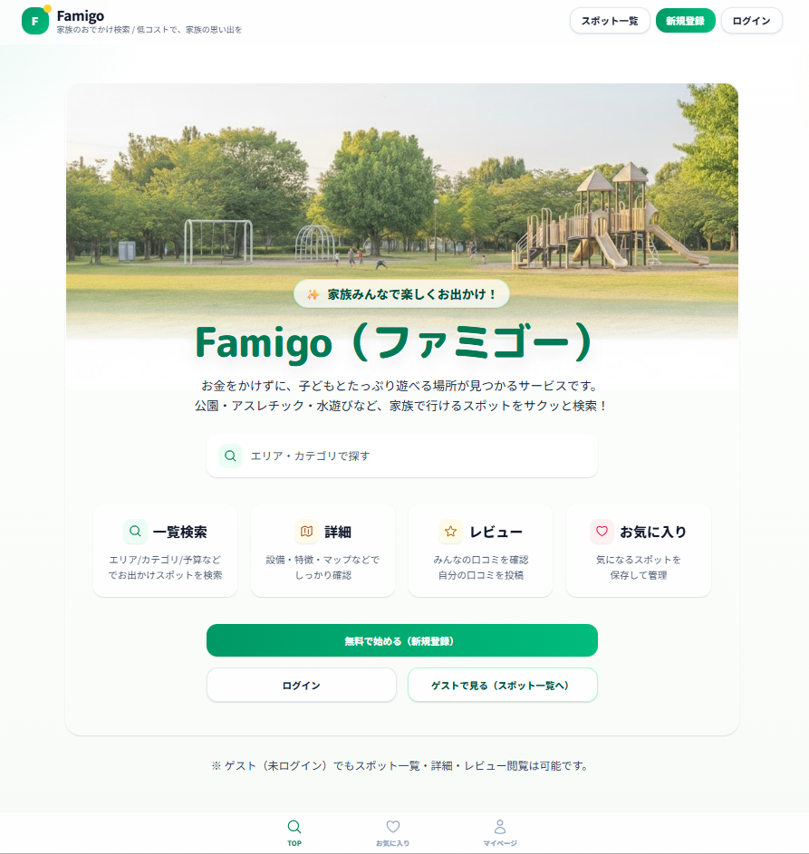
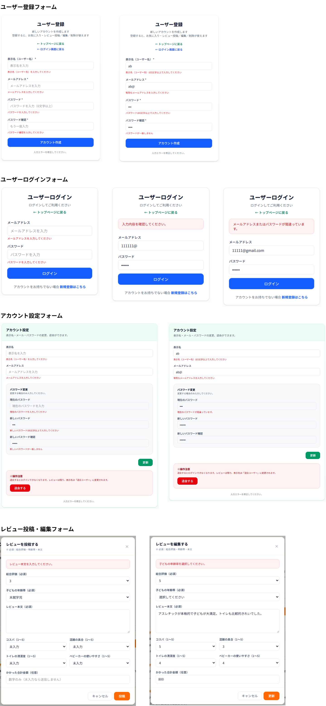
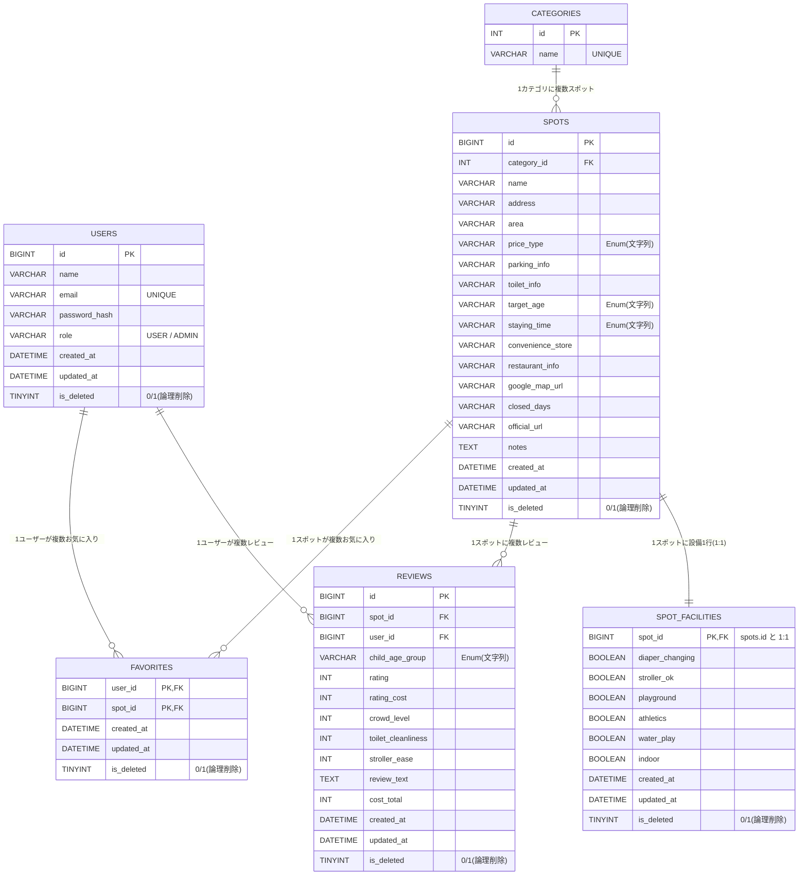
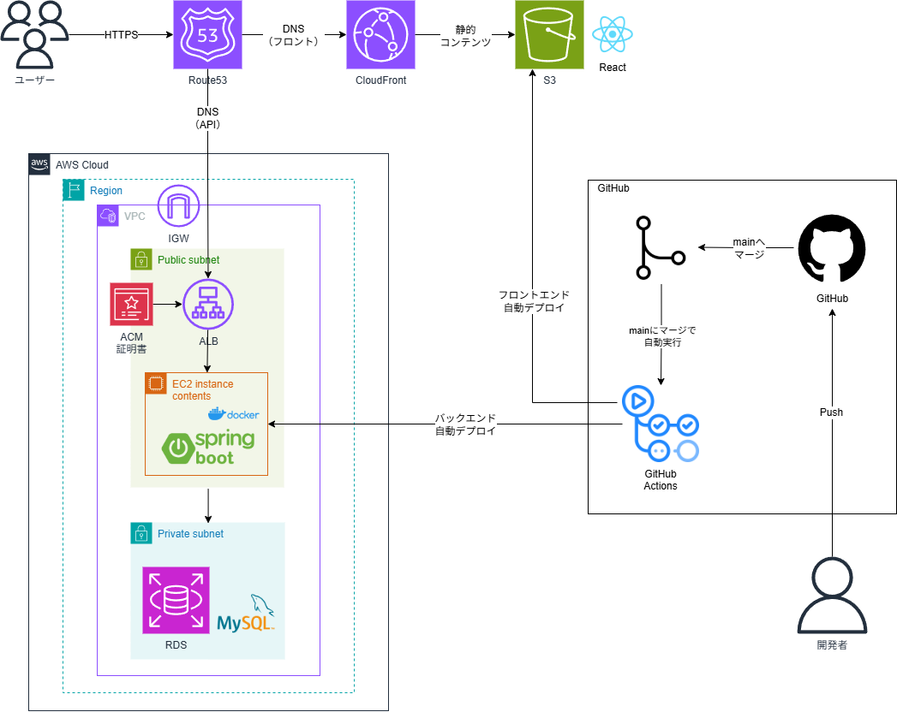
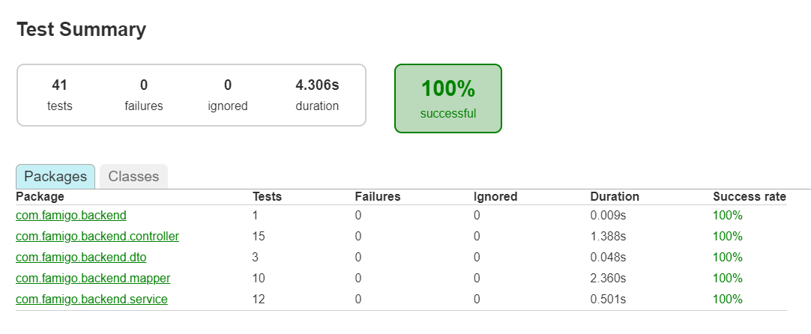

# Famigo（ファミゴー）
 

## デプロイURL

https://famigo-odekake.com

### 【デモユーザー用のアカウント情報】 
　メールアドレス `demo_user@example.com`  
　パスワード  `demo1234`
  

## サービス概要
Famigoは、子ども連れの家族が「なるべくお金をかけずに、たっぷり遊べる場所」を
効率よく見つけるためのお出かけ情報サービスです。 
公園・アスレチック・水遊び場などのスポットを条件で絞り込み検索できるほか、
実際に訪れたパパ・ママが設備・混雑状況・費用感などを「親の目線」でレビュー投稿することで、
子連れ家族に役立つリアルな情報を共有し合えます。

- 未ログインでも：スポット検索・詳細閲覧・レビュー閲覧OK
- ログインすると：お気に入り、レビュー投稿/編集/削除、アカウント設定が使えます

### 主なターゲットユーザー
- 未就学児〜中学生の子どもを持つ保護者
- 「探す」: オムツ替えやベビーカー可否などの設備条件から、子連れに優しい場所かを知りたい方
- 「共有する」: 自身の体験（コスパ、混雑具合、トイレ清潔感など）を投稿し、他の子育て世帯に役立てたい方
- 「ストックする」: 気に入った場所をリスト化し、自分だけのお出かけ帳を作りたい方
  

## 制作背景
私は２人の小学生の息子がおり、家族そろって楽しめる場所に出かけるのが大好きです。 
とは言ってもテーマパーク等のお金がかかる施設に頻繁に行けるわけでもなく、
安くて楽しい良い場所はないか、Web情報をよく探していました。 
ただし、子どもと出かけるとなると、「楽しそう」だけではなかなか決められず **“条件”が先に来る**ことが多いです。 
（オムツ替えはある？／ベビーカーはOK？／トイレはキレイ？／水遊びできる？など） 
SNSや地図アプリ、個人ブログなどで家族向けのリアルな情報は見つかる一方、
**条件（設備・対象年齢・費用感など）を満たす情報を揃えるまでに時間がかかる**と感じていました。 

そこで **「子ども連れ家族が気になるポイント」に寄せた検索と口コミ** をまとめて確認できるサービスがあればよいと思い作りました。

サービス名の「famigo（ファミゴー）」は、Family（家族）とGo（出かける）を組み合わせた造語です。 
語感を少しポップにし、家族向けらしい親しみやすさと「行ってみよう！」と前向きになれる雰囲気を意識しました。
  

## 主な使用技術・選定理由

### ◆ バックエンド
- Java 21
- Spring Boot 3.5.7
- Spring Security（JWT）
- MyBatis
- Flyway（マイグレーション）

#### 【選定理由】 
型安全性による保守性の高さと、実務での採用実績の多さから Java / Spring Boot を選定。 
エリア・カテゴリ・設備など複数条件を組み合わせる動的検索が必要なため、SQLを直接記述して柔軟に制御できる MyBatis を選定。

### ◆ フロントエンド
- React 19 / TypeScript
- Vite
- Tailwind CSS v4

#### 【選定理由】 
コンポーネント単位でUIを管理しやすく、スムーズな検索体験（SPA）を提供でき、
実務採用実績が豊富なため React / TypeScript を選定。 

[フロントエンドリポジトリはこちら](https://github.com/tomo-taka108/famigo-frontend)

### ◆ テスト
- JUnit 5

### ◆ インフラ・その他
- AWS（Route53 / CloudFront / S3 / VPC / ALB / EC2 / RDS / ACM）
- Docker（バックエンド）
- MySQL
- Git・GitHub

#### 【選定理由】 
実務採用実績が豊富で、フロント・API・DBの責任範囲を明確に分離できるため AWS を選定。 
ローカルと本番の実行環境を統一し、環境差分による不具合を防ぐために Docker を導入。
  

## 機能一覧

### 認証・ユーザー
- ユーザー登録（登録後、自動ログイン）
- ログイン
- ログアウト
- ユーザー情報編集（表示名、メールアドレス、パスワードの変更）
- ユーザー削除（退会）

### お出かけスポット
- スポットの一覧表示
- スポットの詳細表示
- スポットの条件検索

### レビュー（ログイン必須）
- レビューの一覧表示（未ログインでも閲覧可）
- レビューの投稿
- 自分のレビュー編集／削除

### お気に入り（ログイン必須）
- お気に入りの登録／解除
- お気に入りの一覧表示
  

## 操作画面

### ▼ トップページ

### ▼ ユーザー登録
<video src="https://github.com/user-attachments/assets/e95c1a51-c2b1-49c5-841d-0defc9112a24" controls style="width: 100%;"></video>

### ▼ ユーザーログイン → ログアウト
<video src="https://github.com/user-attachments/assets/eea8e624-5639-4152-8bb4-d3dbefb0055c" controls style="width: 100%;"></video>

### ▼ ユーザー情報編集（表示名、メールアドレス、パスワードの変更）
<video src="https://github.com/user-attachments/assets/94b0e9f7-4d78-437c-803d-1a0c4b52c651" controls style="width: 100%;"></video>

### ▼ スポット一覧表示 → 条件検索 → 条件該当のスポット一覧表示 → スポット詳細表示
<video src="https://github.com/user-attachments/assets/f2851139-6315-4a48-b258-8dc1b753deea" controls style="width: 100%;"></video>

### ▼ レビュー閲覧 → レビュー投稿
<video src="https://github.com/user-attachments/assets/a4ac4f1c-d41f-4eab-9677-c0a7cb4a7b32" controls style="width: 100%;"></video>

### ▼ 自分のレビュー編集 → 自分のレビュー削除
<video src="https://github.com/user-attachments/assets/d0b84de7-e748-41e9-ae36-305f29494b2d" controls style="width: 100%;"></video>

### ▼ お気に入りの登録／解除 → お気に入り一覧表示
<video src="https://github.com/user-attachments/assets/b43cbea6-41ad-45ba-a36c-2ecb267be01d" controls style="width: 100%;"></video>

### ▼ フォームバリデーション

  

## API仕様書
[SwaggerによるAPI仕様書](https://tomo-taka108.github.io/famigo-backend/)
  

## APIのURL設計

### 外部認証
| メソッド | エンドポイント           | 説明                      | アクセス権限 |
|------|-------------------|-------------------------|--------|
| POST | `/api/users`      | ユーザー情報を新規登録する（登録後にJWT発行） | GUEST  |
| POST | `/api/auth/token` | ログインする（JWT発行）           | GUEST  |

### ユーザー情報管理
| メソッド | エンドポイント          | 説明                          | アクセス権限 |
|---|------------------|-----------------------------|---|
| GET  | `/api/users/me`  | 自分のユーザー情報を取得する              | USER/ADMIN |
| PUT | `/api/users/me`  | 自分のプロフィール（表示名＋メールアドレス）を変更する | USER/ADMIN |
| PUT | `/api/users/me/password` | 自分のパスワードを変更する               | USER/ADMIN |
| DELETE | `/api/users/me`  | 退会する（ユーザー情報の論理削除）           | USER/ADMIN |

### スポット
| メソッド | エンドポイント | 説明                         | アクセス権限 |
|---|---|----------------------------|---|
| GET | `/api/spots` | 検索条件（※）を任意に指定してスポット一覧を取得する | GUEST |
| GET | `/api/spots/{id}` | 指定したスポットの詳細情報を取得する         | GUEST |

**（※）検索条件** 
　キーワード、カテゴリ、予算、対象年齢、設備情報 

　【検索クエリ例（フロントから利用）】 
　`/api/spots?keyword=公園&categoryIds=1&price=FREE&age=PRESCHOOL&facilities=diaper&facilities=water`

### カテゴリ
| メソッド | エンドポイント | 説明          | アクセス権限 |
|---|---|-------------|---|
| GET | `/api/categories` | カテゴリ一覧を取得する | GUEST |

### レビュー
| メソッド | エンドポイント | 説明                    | アクセス権限 |
|---|---|-----------------------|---|
| GET | `/api/spots/{spotId}/reviews` | 指定したスポットのレビュー一覧を取得する  | GUEST |
| POST | `/api/spots/{spotId}/reviews` | 指定したスポットのレビューを投稿する    | USER/ADMIN |
| PUT | `/api/spots/{spotId}/reviews/{reviewId}` | 指定したスポットの自分のレビューを編集する | USER/ADMIN |
| DELETE | `/api/spots/{spotId}/reviews/{reviewId}` | 指定したスポットの自分のレビューを削除する | USER/ADMIN |

### お気に入り
| メソッド | エンドポイント | 説明                  | アクセス権限 |
|---|---|---------------------|---|
| GET | `/api/favorites` | 自分のお気に入りスポット一覧を取得する | USER/ADMIN |
| POST | `/api/favorites/{spotId}` | 指定したスポットをお気に入り登録する  | USER/ADMIN |
| DELETE | `/api/favorites/{spotId}` | 指定したスポットをお気に入り解除する  | USER/ADMIN |

### ALBのヘルスチェック
| メソッド | エンドポイント   | 説明             | アクセス権限 |
|------|-----------|----------------|---|
| GET | `/health` | ALBのヘルスチェックをする | GUEST |

 

## DB設計
### ◆ テーブル概要
- `users`（一般ユーザー／管理者アカウントを管理する）
- `categories`（公園／動物園／室内遊び場などのカテゴリを定義する）
- `spots`（お出かけスポットに関する主要情報を管理する）
- `spot_facilities`（お出かけスポットの設備情報を管理する：spotsと1:1の関係）
- `reviews`（ユーザーが投稿するレビュー情報を管理する：spotsとusersに紐づく）
- `favorites`（ユーザーのお気に入りスポットを管理する：spotsとusersに紐づく）

### ◆ ER図

```mermaid
erDiagram

  USERS {
    BIGINT id PK
    VARCHAR name
    VARCHAR email "UNIQUE"
    VARCHAR password_hash
    VARCHAR role "USER / ADMIN"
    DATETIME created_at
    DATETIME updated_at
    TINYINT is_deleted "0/1(論理削除)"
  }
  
  CATEGORIES {
    INT id PK
    VARCHAR name "UNIQUE"
  }
  
  SPOTS {
    BIGINT id PK
    INT category_id FK
    VARCHAR name
    VARCHAR address
    VARCHAR area
    VARCHAR price_type "Enum(文字列)"
    VARCHAR parking_info
    VARCHAR toilet_info
    VARCHAR target_age "Enum(文字列)"
    VARCHAR staying_time "Enum(文字列)"
    VARCHAR convenience_store
    VARCHAR restaurant_info
    VARCHAR google_map_url
    VARCHAR closed_days
    VARCHAR official_url
    TEXT notes
    DATETIME created_at
    DATETIME updated_at
    TINYINT is_deleted "0/1(論理削除)"
  }
  
  SPOT_FACILITIES {
    BIGINT spot_id PK,FK "spots.id と 1:1"
    BOOLEAN diaper_changing
    BOOLEAN stroller_ok
    BOOLEAN playground
    BOOLEAN athletics
    BOOLEAN water_play
    BOOLEAN indoor
    DATETIME created_at
    DATETIME updated_at
    TINYINT is_deleted "0/1(論理削除)"
  }
  
  REVIEWS {
    BIGINT id PK
    BIGINT spot_id FK
    BIGINT user_id FK
    VARCHAR child_age_group "Enum(文字列)"
    INT rating
    INT rating_cost
    INT crowd_level
    INT toilet_cleanliness
    INT stroller_ease
    TEXT review_text
    INT cost_total
    DATETIME created_at
    DATETIME updated_at
    TINYINT is_deleted "0/1(論理削除)"
  }
  
  FAVORITES {
    BIGINT user_id PK,FK
    BIGINT spot_id PK,FK
    DATETIME created_at
    DATETIME updated_at
    TINYINT is_deleted "0/1(論理削除)"
  }
  
  CATEGORIES ||--o{ SPOTS : "1カテゴリに複数スポット"
  SPOTS ||--|| SPOT_FACILITIES : "1スポットに設備1行(1:1)"
  USERS ||--o{ REVIEWS : "1ユーザーが複数レビュー"
  SPOTS ||--o{ REVIEWS : "1スポットに複数レビュー"
  USERS ||--o{ FAVORITES : "1ユーザーが複数お気に入り"
  SPOTS ||--o{ FAVORITES : "1スポットが複数お気に入り"
```
  

## インフラ構成図

  

## 自動テスト

JUnit 5 による自動テストを実装しています。  
「入力チェック → APIレスポンス → ビジネスロジック → SQL（DB）」が壊れていないことを、層ごとに確認しています。

- **DTO（バリデーション）**  
  必須項目・形式・整合性（例：登録やユーザー情報更新の入力チェック）を確認

- **Controller層**  
  リクエストに対して、ステータスコードやレスポンスが期待通り返ることを確認

- **Service層**  
  ビジネスルールの分岐（例：認証失敗、存在しないデータ、条件/権限の不一致など）を確認

- **Mapper層**  
  MySQLに接続してSQLを実行し、期待通りに動くこと（取得・登録・更新・削除、条件検索など）を確認

### テスト結果

  

## 工夫した点

### ◆ JWT認証の導入
ログインが必要な機能（レビュー投稿・お気に入り登録・ユーザー情報変更など）を安全に提供したくて、
JWT認証について自分で調べて導入しました。 
最初は「ログイン状態をどう保持するのか」が曖昧だったため、Cookieセッション方式とJWT方式を比較しました。 
その結果、React（SPA）＋API構成ではサーバー側でログイン状態（セッション）を保持せず、
リクエストごとにトークンで本人確認できるJWT（Bearer）の方が、
フロントとバックを分離した構成でも扱いやすいと考え採用しました。 
実装では、リクエストの `Authorization: Bearer ...` を検証し、正しいトークンの場合だけユーザーとして認証されるようにしました。 
あわせて、未ログインでも閲覧できるAPI（一覧・詳細など）と、ログイン必須の操作系APIを分けてルールを整理し、
機能追加しても安全性が崩れにくい形にしました。

### ◆ DBはFlywayで管理
最初はSQLを手動で作ればいいと思っていましたが、「DBを作り直す」「環境を変える（ローカル/本番/CI）」が発生すると、 
手作業だと時間がかかりミスも起きやすいと感じました。 
そこで調べたところ、Spring Bootでは Flyway を使うと「DB定義をバージョン管理して自動で適用できる」ことが分かり、
スクールの講義では扱われていない技術でしたが、自分で調べた結果、以下の利点があると判断して導入しました。
- `db/migration` のSQLをGit管理でき、DB変更履歴を追える
- 新しい環境でも起動時にマイグレーションが適用され、スキーマの再現性が上がる
- テストでも「本番と同じスキーマ」を前提にでき、環境差分による不具合を減らせる

### ◆ 公開運用を前提にした構成整理
デプロイ先は Vercel / GitHub Pages（主にフロント向け）、Render等のPaaS、Supabase なども候補に挙げて比較しました。 
今回は、公開後の運用を考えたときに「責任範囲の切り分けがしやすい」「トラブル時に原因を追いやすい」「段階的に拡張しやすい」  
という点を考慮し、また、
実務で多く使われている構成を自分で設計したい思いから、AWSを採用しました。 
構成は **フロント：S3 + CloudFront（静的配信/CDN）／API：ALB + EC2（HTTPS終端・ヘルスチェック）／DB：RDS（MySQL）**
と役割分担し、問題が起きてもフロント・API・DBのどこに原因があるかを追いやすい形にしています。 
あわせて、HTTPS前提（証明書・リダイレクト）や最小権限のネットワーク設定など、公開運用で詰まりやすい点を先に意識して整備しました。

### ◆ セキュリティ・堅牢性への配慮

#### バリデーションの二重管理
入力チェックはフロントエンドだけでなく、バックエンドのDTO層でも独立して実装しています。
APIを直接呼び出された場合やフロント側の検証をすり抜けた場合でも、サーバー側で必須チェック・形式チェック・整合性チェックが働くようにしており、
不正なデータがDBに保存されない設計にしています。

#### 認可制御（自分のデータのみ操作可能）
ログイン済みであればレビューを操作できるという設計ではなく、
「JWTから取得したユーザーIDと、操作対象のレビューの投稿者IDが一致するか」をサービス層で確認しています。
一致しない場合はエラーを返す処理を入れることで、他人のレビューを誤って・意図的に書き換えられないようにしています。

#### 論理削除の採用
ユーザー・スポット・レビュー・お気に入りのデータはすべて、物理削除ではなく `is_deleted` フラグによる論理削除で管理しています。
誤削除や不正操作が発生した場合にデータを追跡・復元できる余地を残しつつ、通常の検索・表示には削除済みデータが混入しない設計にしています。
  

## 今後の展望

### 📌 短期的な対応（次に伸ばしやすい改善）
#### 1) レビューの見せ方を分かりやすくする
- スポット詳細で「平均評価」や「項目別の平均（例：費用感、混雑など）」を表示し、ひと目で比較できるようにする

#### 2) お気に入りの“人気度”を見える化する
- スポットごとに「お気に入り登録者数」を集計して表示し、人気の目安として使えるようにする

#### 3) 管理者機能を追加する（まずは最低限）
- スポット情報の新規追加・編集（UI上で情報を更新できるようにする）
- カテゴリ管理（categoriesの追加・名称変更）
- ユーザー情報の管理機能（ユーザー一覧の閲覧、利用停止などの無効化）
- 不適切なレビューの削除（荒らし対策の入口）

#### 4) マイページを充実させる
- 自分が投稿したレビューの一覧表示・編集
- （将来のスポット投稿に備えて）自分が投稿したスポット情報の一覧表示・編集

#### 5) スポット詳細に写真・動画を追加できるようにする
- スポット詳細ページに写真や動画を投稿できるようにし、現地の雰囲気が伝わるようにする

### 📌 中長期的な対応（拡張・実運用を見据えた発展）
#### 1) 検索の高度化（場所で探しやすくする）
- 都道府県・市区町村を指定して絞り込みできるようにする
- 地図上でスポットを探せる「マップ検索」を追加する
- 位置情報を使って「自分の現在地」も地図に表示し、近いスポットから探せるようにする（近い順検索）

#### 2) 不適切利用への対策（荒らしを防ぐ仕組み）
- 不適切投稿の通報機能（ユーザーが管理者へ連絡できる仕組み）
- 短時間の連続投稿や総当たりログインを防ぐため、同じ人（ユーザー）や同じ接続元（IP）からの連続アクセスを制限する仕組み（回数制限）

#### 3) 管理者機能の拡充
- ロール変更（USER/ADMIN）や、管理者の操作履歴を記録して追えるようにする（誰が何を変更したか）
- スポット情報の新規追加・編集を「管理者だけ」ではなく、承認制で広げる
  - ユーザーが管理者に申請
  - 管理者が承認したユーザーは、スポット情報の新規追加・編集ができる（信頼できる投稿者を増やす）

#### 4) セキュリティ強化（不正ログイン対策）
- 連続でログインに失敗した場合、一定時間ログインできないようにする（アカウントロック）
- 操作履歴（監査ログ）を本格運用し、レビュー編集・削除などの履歴を追えるようにする

